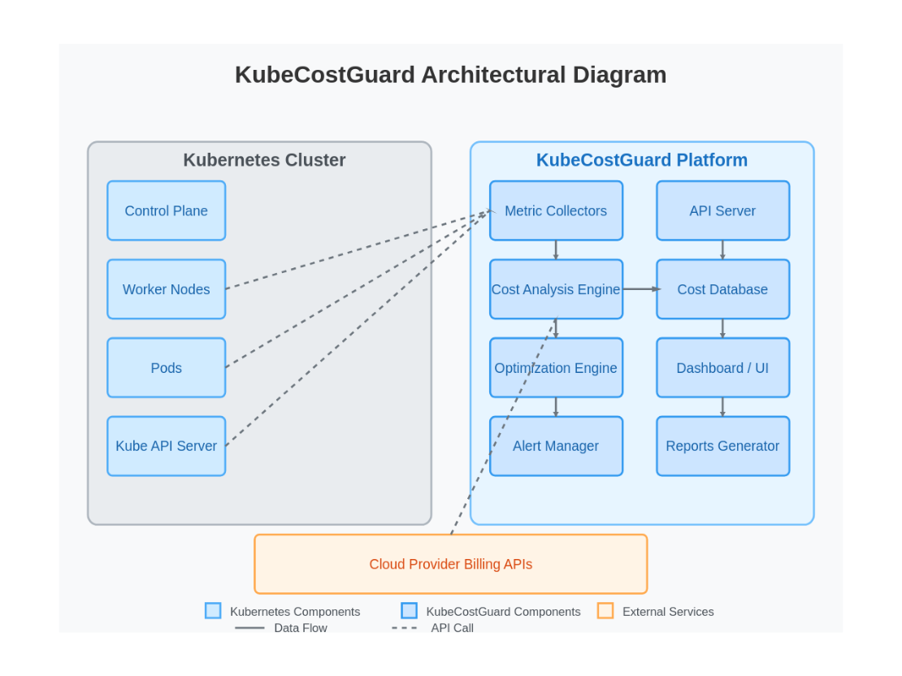

# KubeCostGuard


## Overview

KubeCostGuard is an open-source Kubernetes tool that combines health monitoring with cost optimization capabilities. It helps you maintain the health of your Kubernetes clusters while optimizing resource usage and reducing cloud costs.

### Key Features

- **Health Monitoring**: Track pod, node, and control plane health metrics
- **Cost Analysis**: Get detailed insights into your Kubernetes spending
- **Optimization Recommendations**: Automatically identify cost-saving opportunities
- **Multi-Cloud Support**: Works with AWS, GCP, and Azure
- **Interactive Dashboard**: Visualize health metrics and cost data
- **Cost Attribution**: Understand costs by namespace, deployment, and label
- **Optimization Actions**: Apply recommendations with one click

## Quick Start

### Using Helm

```bash
# Add the KubeCostGuard Helm repository
helm repo add kubecostguard https://github.com/ochestra-tech/kubecostguard/charts
helm repo update

# Install KubeCostGuard
helm install kubecostguard kubecostguard/kubecostguard \
  --namespace kubecostguard \
  --create-namespace \
  --set cloudProvider=aws
```

### Using Kubernetes Manifests

```bash
# Clone the repository
git clone https://github.com/ochestra-tech/kubecostguard.git
cd kubecostguard

# Apply Kustomize configuration
kubectl apply -k deployments/kustomize/base

# Check deployment status
kubectl get pods -n kubecostguard
```

### Accessing the Dashboard

After deploying KubeCostGuard, access the dashboard:

```bash
# Port-forward the service
kubectl port-forward -n kubecostguard svc/kubecostguard 8080:8080

# Access the dashboard at http://localhost:8080
```

## Configuration

KubeCostGuard is configured via a YAML configuration file. You can customize various aspects of the monitoring, cost analysis, and optimization processes.

### Basic Configuration

```yaml
kubernetes:
  kubeconfig: ""  # Leave empty for in-cluster config
  inCluster: true

health:
  scrapeIntervalSeconds: 60
  enabledCollectors:
    - node
    - pod
    - controlplane
  alertThresholds:
    cpuUtilizationPercent: 80
    memoryUtilizationPercent: 85
    podRestarts: 5

cost:
  updateIntervalMinutes: 15
  cloudProvider: "aws"  # aws, gcp, azure, or leave empty for cloud-agnostic mode
  pricingApiEndpoint: ""
  storageBackend: "sqlite"

optimization:
  enableAutoScaling: true
  idleResourceThreshold: 0.2
  rightsizingThreshold: 0.6
  enableSpotRecommender: true
  minimumSavingsPercent: 20
  optimizationIntervalHours: 24
  applyRecommendations: false  # Set to true to automatically apply recommendations
  dryRun: true  # Set to false to actually make changes
```

### Cloud Provider Configuration

#### AWS

```yaml
cost:
  cloudProvider: "aws"
  pricingApiEndpoint: "https://pricing.us-east-1.amazonaws.com"
```

#### GCP

```yaml
cost:
  cloudProvider: "gcp"
  pricingApiEndpoint: "https://cloudbilling.googleapis.com/v1"
```

#### Azure

```yaml
cost:
  cloudProvider: "azure"
  pricingApiEndpoint: ""  # Uses default endpoint
```

## Architecture

KubeCostGuard consists of several core components:

1. **Health Monitor**: Collects and analyzes Kubernetes resource health metrics
2. **Cost Analyzer**: Retrieves and processes cost data from cloud providers
3. **Optimizer**: Generates and applies cost optimization recommendations
4. **API Server**: Provides RESTful API endpoints for the dashboard and integrations
5. **Storage Backend**: Persists historical data and configuration



## Development

### Prerequisites

- Go 1.21+
- Docker
- Kubernetes cluster (for testing)
- Access to one of the supported cloud providers (for cost analysis)

### Building from Source

```bash
# Clone the repository
git clone https://github.com/yourusername/kubecostguard.git
cd kubecostguard

# Build the binary
make build

# Run locally
./kubecostguard --config=config.yaml

# Build Docker image
make docker-build
```

### Project Structure

```
kubecostguard/
├── cmd/
│   └── kubecostguard/         # Application entry point
├── internal/
│   ├── api/                   # API server
│   ├── config/                # Configuration management
│   ├── cost/                  # Cost analysis
│   │   ├── providers/         # Cloud provider integrations
│   │   └── recommender/       # Cost optimization recommendations
│   ├── health/                # Health monitoring
│   │   ├── collectors/        # Metric collectors
│   │   └── alerting/          # Alert management
│   ├── kubernetes/            # Kubernetes client
│   └── optimization/          # Optimization actions
├── pkg/                       # Public packages
├── deployments/               # Deployment manifests
│   ├── helm/                  # Helm chart
│   └── kustomize/             # Kustomize configuration
├── config/                    # Configuration files
├── ui/                        # Web UI components
├── docs/                      # Documentation
└── examples/                  # Example configurations
```

## API Reference

KubeCostGuard provides a comprehensive REST API for integration with other tools.

### Health Endpoints

- `GET /api/health/status`: Overall health status
- `GET /api/health/metrics`: Detailed health metrics
- `GET /api/health/alerts`: Active alerts

### Cost Endpoints

- `GET /api/cost/summary`: Cost summary
- `GET /api/cost/namespaces`: Costs by namespace
- `GET /api/cost/nodes`: Costs by node
- `GET /api/cost/trends`: Cost trends over time

### Optimization Endpoints

- `GET /api/optimize/recommendations`: Get optimization recommendations
- `POST /api/optimize/apply/:id`: Apply a specific recommendation
- `GET /api/optimize/history`: Optimization history

## Supported Kubernetes Distributions

- Amazon EKS
- Google GKE
- Microsoft AKS
- Red Hat OpenShift
- Vanilla Kubernetes

## Contributing

Contributions are welcome! Please see [CONTRIBUTING.md](CONTRIBUTING.md) for details.

### Development Workflow

1. Fork the repository
2. Create a feature branch
3. Make your changes
4. Run tests: `make test`
5. Submit a pull request

## License

KubeCostGuard is licensed under the MIT License. See [LICENSE](LICENSE) for details.

## Community

- Join our Slack channel (https://slack.kubecostguard.io)
- Follow us on Twitter (https://twitter.com/kubecostguard)
- Check out our blog (https://kubecostguard.io/blog)

## FAQ

### How does KubeCostGuard calculate costs?

KubeCostGuard uses cloud provider APIs to retrieve current pricing information and combines it with Kubernetes resource usage metrics to calculate costs. For on-premise clusters, it uses a configurable cost model.

### Does KubeCostGuard require special permissions?

Yes, KubeCostGuard needs read access to Kubernetes resources and, depending on your cloud provider, specific IAM permissions to access cost data and make optimization recommendations.

### Can KubeCostGuard automatically apply optimizations?

Yes, by setting `applyRecommendations: true` in the configuration, KubeCostGuard can automatically apply certain optimizations. Use the `dryRun: true` setting to simulate changes without applying them.

### How accurate are the cost estimates?

KubeCostGuard provides cost estimates based on current pricing information from cloud providers. While these estimates are generally accurate, actual billing may vary due to discounts, reserved instances, or other factors.

## Roadmap

- [ ] Enhanced multi-cluster support
- [ ] Machine learning-based cost forecasting
- [ ] Custom optimization policy engine
- [ ] Integration with CI/CD pipelines for cost-aware deployments
- [ ] Support for additional cloud providers
- [ ] Cost anomaly detection

## Acknowledgments

- The Kubernetes community
- All our contributors and supporters
- Open-source projects that inspired us